# Competitive Analysis: Trial Conversion Strategies
## Slack · Notion · Figma · Linear → Lessons for NovaByte

**Prepared for:** VP Product & Leadership Team  
**Date:** March 1, 2026  
**Context:** NovaByte's 14-day free trial converts at **8.2%** (industry benchmark: 15–25% for PLG B2B SaaS). This report analyzes four best-in-class PLG companies to identify actionable tactics for improving NovaByte's conversion rate.

---

## Side-by-Side Comparison

| Dimension | **Slack** | **Notion** | **Figma** | **Linear** | **NovaByte (today)** |
|---|---|---|---|---|---|
| **Model** | Freemium (no time limit) | Freemium (no time limit) | Freemium (no time limit) | Freemium (no time limit) | 14-day time-limited trial |
| **Free Tier** | Unlimited users; 10K msg history, 10 integrations, 5 GB storage | Unlimited pages for 1 user; team collab limits | 3 Figma + 3 FigJam files; unlimited viewers | Unlimited members; 2 teams, 250 active issues | Up to 5 users, 3 projects, basic features |
| **Entry Paid Price** | ~$8.75/user/mo (Pro) | $10/user/mo (Plus) | $15/editor/mo (Professional) | $8/user/mo (Basic) | $15/user/mo (Pro) |
| **Conversion Rate** | **30–40%** (teams 10+ users) | **~4%** overall; higher for teams | Not disclosed; est. high via collab loops | Not disclosed; strong bottom-up signals | **8.2%** |
| **Primary Conversion Trigger** | Message history limit hit | Team collaboration limit hit | File/project limit hit | Active issue limit hit (250) | Trial expiration (Day 14) |
| **Time Pressure?** | No — usage-based pressure | No — usage-based pressure | No — usage-based pressure | No — usage-based pressure | Yes — hard 14-day cliff |

> [!IMPORTANT]
> **The most significant structural difference:** All four competitors use **usage-based conversion triggers** (you hit a limit when the product is valuable to you), while NovaByte uses a **time-based trigger** (the trial expires whether you've found value or not). This is the single biggest design gap.

---

## 1. Slack — Freemium to Paid Conversion

### Trial & Free Tier Structure
Slack's free tier is **permanently free** with no time limit. It provides genuinely useful team messaging with strategic constraints:

| Free | Paid (Pro, $8.75/user/mo) |
|---|---|
| 10,000 most recent messages searchable | Full message history |
| 10 app integrations max | Unlimited integrations |
| 5 GB total file storage | 10 GB per user |
| 1:1 voice/video calls only | Group calls, screen sharing |
| No SSO, no compliance exports | SAML SSO, compliance tools |

### Key Conversion Triggers
1. **The message history wall** — Teams hit the 10K message limit and lose access to older conversations. This is the #1 driver. The pain is *felt collectively* — one user can't see a message they need, and suddenly the whole team cares.
2. **Integration ceiling** — Power users hit 10 integrations and can't add the next critical tool (Jira, GitHub, Salesforce).
3. **Admin/security needs** — As teams formalize, they need SSO, guest access controls, and export capabilities.

### Nudging Strategy

| Channel | Tactic |
|---|---|
| **In-app** | Contextual banners appear *at the moment of friction* (e.g., "You've reached your message limit. Upgrade to see your full history."). No generic pop-ups. |
| **Email** | Minimal drip. Slack famously avoids aggressive email sequences. Value messages are tied to usage milestones, not calendar days. |
| **Product** | The free tier is deliberately designed so the product *gets better the more you use it*, creating organic urgency. |

### What Makes Slack's Approach Work
- **Conversion is triggered by value, not time.** Users upgrade when Slack is already indispensable.
- **Team-level network effects.** One user adopts → invites teammates → team hits limits → team converts. Slack doesn't sell to individuals; it sells to teams via individuals.
- **30–40% conversion for 10+ user teams** is exceptional because the free tier is so good that when people pay, they *know* they need it.

### 💡 NovaByte Takeaway
> Slack proves that the most powerful conversion nudge isn't an email — it's a product limitation that becomes painful precisely when the user has gotten enough value to justify paying. NovaByte's 14-day time cliff forces a decision before many users reach that threshold.

---

## 2. Notion — Trial Experience & Conversion Nudges

### Trial & Free Tier Structure
Notion offers a **permanent free plan** for individuals (unlimited pages, unlimited blocks) and a team-focused upgrade path:

| Free (Personal) | Plus ($10/user/mo) | Business ($18/user/mo) |
|---|---|---|
| Unlimited pages for 1 user | Unlimited team pages | Everything in Plus |
| 5 MB file uploads | Unlimited file uploads | SAML SSO |
| 7-day page history | 30-day page history | 90-day page history |
| 10 guest collaborators | 100 guests | 250 guests |
| Basic AI (limited) | Full Notion AI add-on | Advanced AI + bulk export |

### Key Conversion Triggers
1. **The collaboration wall** — Notion is generous solo, but the moment you need *team features* (shared workspaces, permissions, >10 guests), you must pay. This is intentional: solo use builds habit, team use drives revenue.
2. **File upload limits** — 5 MB cap on free nudges users who need to share docs with embedded media.
3. **Template-driven commitment escalation** — Users browse templates → duplicate them → customize them → share with teammates → psychologically invested → upgrade feels natural.

### Nudging Strategy

| Channel | Tactic |
|---|---|
| **Onboarding** | Personalized first run: asks your role, team size, and goals. Pre-loads relevant templates. Reduces time-to-value from hours to minutes. |
| **In-app** | Contextual upgrade prompts appear when you *try* to do something restricted (invite 11th guest, upload large file). The message shows what you'll unlock, not what you're losing. |
| **Email** | Behavior-triggered sequences: first database created → email on advanced views; first team invite → email on collaboration features. Not calendar-based. |
| **Community** | Ambassador and template creator programs turn free users into evangelists who organically drive team adoption. |
| **AI upsell** | Notion AI is available as an add-on, providing incremental revenue and acting as a "taste" that drives full plan upgrades. |

### What Makes Notion's Approach Work
- **Commitment escalation** — Each small step (browse → duplicate template → customize → invite) deepens investment before asking for money.
- **The individual-to-team bridge** — Free individual use creates champions who drag their teams into Notion, triggering the paid tier.
- **Personalized onboarding** — Asking team-size and use-case upfront means solo users don't see team-oriented prompts (and vice versa).

### 💡 NovaByte Takeaway
> Notion's greatest lesson is **adaptive onboarding**. NovaByte currently sends the same drip emails to Raj (14-person team, daily user) and Marcus (solo freelancer, 3 logins). Notion would give each of them a radically different experience from minute one.

---

## 3. Figma — Product-Led Growth Approach

### Trial & Free Tier Structure
Figma's free "Starter" plan is **permanently free** and remarkably generous:

| Free (Starter) | Professional ($15/editor/mo) | Organization ($45/editor/mo) |
|---|---|---|
| 3 Figma + 3 FigJam files | Unlimited files | Everything in Pro |
| Unlimited viewers/commenters | Shared & private projects | Design system analytics |
| 2 editors per file | Unlimited editors | SSO + advanced admin |
| 30-day version history | Unlimited version history | Org-wide libraries |
| Community resources | Team libraries, audio conversations | Centralized file management |

### Key Conversion Triggers
1. **File limit crunch** — 3 Figma files is enough to learn and love the tool, but any real project needs more. The upgrade moment comes naturally.
2. **Collaboration multiplication** — Every viewer and commenter is a potential future editor (paid seat). Figma's "unlimited viewers" is a viral growth engine: designers share prototypes → PMs/devs comment → they start editing → new paid seats.
3. **Role-based pricing (2025)** — Figma introduced Collab Seats, Dev Seats, and Full Seats, letting companies expand paid usage to non-designers at different price points. This reduces the friction of "why should our developer pay $15/mo for a design tool?"

### Nudging Strategy

| Channel | Tactic |
|---|---|
| **Product-as-marketing** | Every Figma file shared externally is an ad for Figma. Recipients view/comment for free, experience the tool, and become advocates. |
| **In-app** | Upgrade prompts are shown *at the file limit*, not on a schedule. "You've used 3 of 3 files. Upgrade to create unlimited files." |
| **Community** | Config conference, Community file repository, plugins and templates — all create stickiness that makes switching costly. |
| **Educational** | Extensive free tutorials, YouTube content, and certification programs turn new users into power users before asking them to pay. |
| **Pricing design** | The jump from $0 to $15/editor is softened by the fact that viewers are always free. Teams typically have 3-5x more viewers than editors. |

### What Makes Figma's Approach Work
- **Every share is a sales pitch.** The product markets itself through collaborative usage.
- **Viewers-to-editors pipeline.** Free viewers today convert to paid editors tomorrow.
- **Low-friction upgrade path.** The Professional plan costs the same as the free plan + ∞ files. The value equation is obvious.

### 💡 NovaByte Takeaway
> Figma's key insight: **make the free product a distribution channel, not just a trial**. NovaByte could let trial users share read-only dashboards or sprint reports with stakeholders — each a brand touchpoint and a potential new advocate inside the organization.

---

## 4. Linear — Conversion Funnel Design

### Trial & Free Tier Structure
Linear's free plan is **permanently free** — no time limit, no credit card required:

| Free | Basic ($8/user/mo) | Business ($16/user/mo) |
|---|---|---|
| Unlimited members | All Free features | All Basic features |
| 2 teams | 5 teams | Unlimited teams |
| 250 active issues | Unlimited issues | Private teams, guest accounts |
| Core features (issues, projects, cycles) | Admin roles, unlimited uploads | Advanced analytics (Insights) |
| Slack + GitHub integrations | - | Triage Intelligence, SLAs |

### Key Conversion Triggers
1. **The 250-issue cliff** — Small teams start free. When they hit 250 active issues (a natural growth inflection), they must upgrade. This is Linear's "message history" moment.
2. **Team expansion** — 2-team limit pushes cross-functional orgs (eng + product, etc.) to paid plans.
3. **Speed as a drug** — Linear's UX is so fast that once developers experience it, switching back to Jira feels physically painful. The product creates its own lock-in through superior experience.

### Nudging Strategy

| Channel | Tactic |
|---|---|
| **Product** | Almost zero marketing spend. Linear grew through **bottom-up developer adoption** — devs try it, love it, tell other devs. The product IS the marketing. |
| **In-app** | Minimal. Linear trusts the product experience to drive conversion. Upgrade prompts appear at natural limits (250 issues, 2 teams), not on a schedule. |
| **Programs** | "Linear for Startups" gives free access to paid plans for qualifying early-stage companies — investing in future expansion revenue. |
| **Email** | Extremely light-touch. Linear sends almost no promotional email. Product engagement data shows when teams are close to limits. |
| **Opinionated design** | By *not* offering every configuration option, Linear reduces setup time and gets teams productive faster. Less flexibility = faster time-to-value. |

### What Makes Linear's Approach Work
- **Developer-grade UX creates organic advocacy.** The keyboard shortcuts, speed, and minimalism make developers *want* to evangelize it.
- **Low entry pricing** — $8/user/mo is approximately half of NovaByte's price. This makes the free-to-paid jump feel trivial, especially for small teams.
- **Opinionated defaults** — Linear doesn't try to be everything. It does engineering project management exceptionally well. This clear positioning reduces ICP confusion.

### 💡 NovaByte Takeaway
> Linear proves that **a great product with almost no sales/marketing generates better conversion than aggressive nudging of a mediocre one**. NovaByte's analytics dashboard and workflow templates are already creating Linear-style aha moments (see: Raj's analytics love, Anika's template reaction). The task is to get more users to those moments faster, not to send more emails.

---

## Synthesis: The Conversion Playbook That NovaByte Is Missing

```mermaid
graph LR
    A["🆓 Free/Trial Signup"] --> B["⚡ First Value Moment"]
    B --> C["👥 Team Adoption"]
    C --> D["🚧 Natural Limit Hit"]
    D --> E["💳 Upgrade"]
    
    style A fill:#e1f5fe
    style B fill:#fff9c4
    style C fill:#f3e5f5
    style D fill:#ffe0b2
    style E fill:#c8e6c9
```

### What the Four Competitors Have in Common

| Pattern | Slack | Notion | Figma | Linear | NovaByte? |
|---|---|---|---|---|---|
| Permanently free tier (no time cliff) | ✅ | ✅ | ✅ | ✅ | ❌ (14-day expiry) |
| Conversion triggered by *usage*, not *time* | ✅ | ✅ | ✅ | ✅ | ❌ (calendar-based) |
| Personalized onboarding by user type | ✅ | ✅ | ✅ | ✅ | ❌ (one-size-fits-all) |
| Team-level viral loops | ✅ | ✅ | ✅ | ✅ | Partial (invite flow exists) |
| Behavior-triggered nudges (not calendar emails) | ✅ | ✅ | ✅ | ✅ | ❌ (7-email drip to all) |
| Low-friction upgrade path | ✅ ($8.75) | ✅ ($10) | ✅ ($15) | ✅ ($8) | Partial ($15, no annual discount visible) |

> [!CAUTION]
> NovaByte violates **every** shared principle that drives conversion for these four companies. The 14-day trial with one-size-fits-all drip emails is the opposite of what market leaders do.

---

## Three Things NovaByte Should Do Next Week

These aren't "next quarter" initiatives. These are concrete changes that can be designed and shipped (or at least launched as experiments) within 5–7 business days.

---

### 1. 🔄 Replace the Calendar-Based Email Drip with Behavior-Triggered Nudges

**What to do:**  
Stop the current 7-email sequence that goes to all trial users on a fixed schedule. Replace it with 3–4 behavior-triggered messages based on actual product usage.

**Example triggers:**

| User Behavior | Triggered Message |
|---|---|
| Created a project but hasn't invited teammates (Day 2+) | "Teams using NovaByte with 3+ members see 2x faster sprint delivery. Invite your team →" |
| Visited pricing page but didn't upgrade | "Questions about plans? Here's a quick comparison — or reply to chat with our team." |
| Hit a "wow" feature (analytics dashboard, workflow template) | "You're using [feature] — here's how [Company X] used it to cut sprint planning time by 40%." |
| No login for 3+ days mid-trial | "Your NovaByte trial is waiting. Here's a 2-min setup that most teams start with →" |

**Why this works:** All four competitors (Slack, Notion, Figma, Linear) trigger communications based on what users *do*, not what day it is. Priya (11 logins, 6 invites) and Marcus (3 logins, solo) should receive completely different messaging.

**Effort:** Low-medium. Requires event triggers in Mixpanel → email tool (e.g., Customer.io, Intercom). The current 7-email drip can be redesigned in a few days.

---

### 2. 🎯 Launch Persona-Based Onboarding (Day 1 Experience Fix)

**What to do:**  
Add 2–3 questions to the signup flow (team size, role, primary tool being replaced) and branch the first-run experience accordingly.

**Three tracks:**

| Persona | First-Run Experience |
|---|---|
| **Solo / Small (1-5)** | Simplified setup: skip sprint config, show simple kanban, hide team-first features. Highlight personal productivity. Offer free tier prominently. |
| **Mid-Market Team (6-50)** | Team setup wizard: invite flow → template selector → GitHub/Slack integration check. Surface analytics dashboard early (the #1 aha moment from interviews). |
| **Enterprise Evaluator (50+)** | Security-first experience: SOC 2 badge, link to compliance docs, connect to Solutions Engineering. Don't bury this behind product setup. |

**Why this works:** Notion asks your role and goals on Day 1 and customizes everything downstream. NovaByte currently shows Marcus (freelancer) the same sprint-planning flow as Sarah (VP evaluating for 800 seats). Marcus churns on Day 1 because NovaByte feels like an "aircraft carrier." Sarah churns on Day 3 because she can't find compliance docs.

**Effort:** Medium. Requires signup flow changes + 3 onboarding variants. Can be shipped with conditional logic in the existing flow within a week.

---

### 3. 💰 Make Annual Pricing Visible and Add a Trial-to-Paid Incentive

**What to do:**  
Surface annual billing with a clear discount (15–20%) on the pricing page, in the billing UI, and in a conversion email. Add a time-limited conversion incentive for trial users who commit before Day 14.

**Specifically:**
- Add "Save 20% with annual billing" toggle on the pricing page (Linear, Figma, and Notion all do this prominently).
- Send a Day 10 email to engaged trial users: *"Lock in $12/user/month (annual) — 20% off our standard price. Offer valid until your trial ends."*
- Remove or update expired promo codes (Raj found NOVALAUNCH30 expired — this creates negative friction).

**Why this works:** Three of NovaByte's highest-intent users (Raj, Priya, Anika) explicitly asked for annual billing discounts. Raj said *"If you can get me to $15/seat on annual, I'll have the PO by Friday."* Pricing isn't the core issue, but **price *visibility* and *packaging*** are friction points that are trivially solvable. All four competitors make annual savings obvious and easy.

**Effort:** Low. Pricing page update + one email template + promo code audit. Can be done in 2–3 days.

---

## Summary: The Cost of Inaction

| Metric | Today | With These 3 Changes (Est. Impact) |
|---|---|---|
| Trial conversion rate | 8.2% | 12–14% (conservative, within 90 days) |
| Monthly trials | 3,200 | 3,200 (no acquisition change) |
| Monthly conversions | ~262 | ~384–448 |
| Incremental monthly revenue | — | +$22K–$34K/mo at $15/user (team avg 3 seats) |

> [!NOTE]
> These estimates are conservative. Behavior-triggered nudges alone have been shown to improve SaaS trial conversion by 20–40% vs. calendar-based drip campaigns (source: Appcues, OpenView benchmarks). Combined with persona-based onboarding and pricing visibility, the uplift compounds.

---

*This analysis is based on publicly available information, industry reports, and NovaByte user interview data. Pricing and conversion figures for competitors are sourced from the most recent public data available as of March 2026.*
